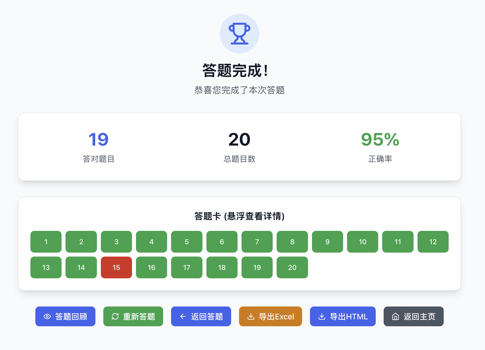
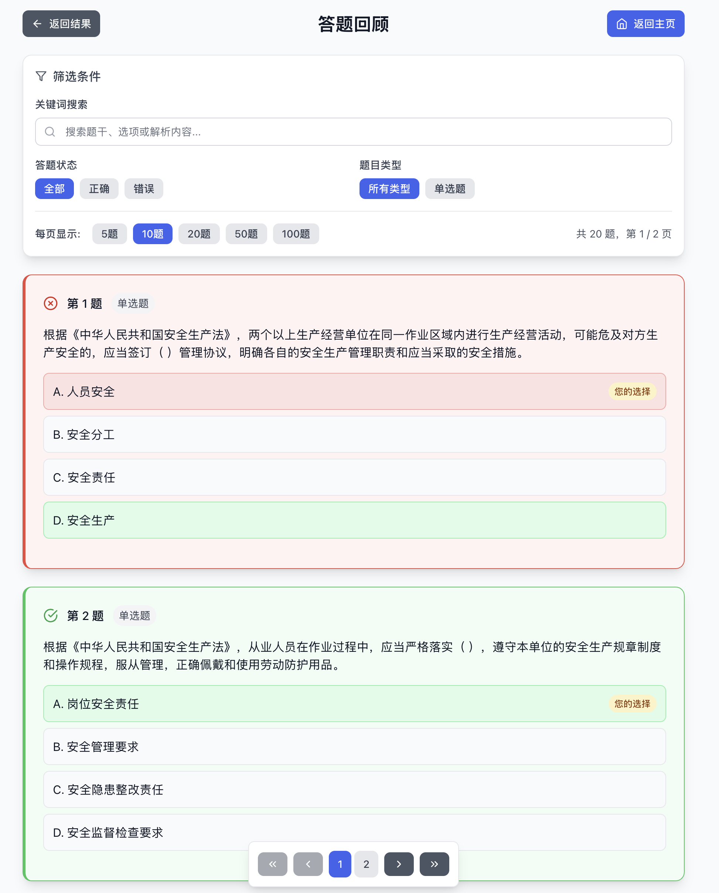

<div align="center">
  <br />
  <h1 style="margin: 0; font-size: 2.5rem; font-weight: bold;">dati</h1>
  <p>
    
    
    
    
    
    
  </p>
  <p>
    <em>
      一个现代化的智能答题系统，支持 Excel 文件导入，提供多种测验模式和完善的用户体验。<br />
      数据不会上传云端，安全保护用户隐私。
    </em>
  </p>
  <p>
    <a href="https://kearney3.github.io/dati/" target="_blank" style="font-size: 20px; font-weight: bold; text-decoration: none;">
      👉 在线体验地址（Github Pages）
    </a>
  </p>
  <p>
    <a href="https://datiapp.vercel.app/" target="_blank" style="font-size: 18px; font-weight: bold; text-decoration: none; margin-right: 16px;">
      🚀 Vercel 访问地址
    </a>
    <a href="https://datiapp.netlify.app/" target="_blank" style="font-size: 18px; font-weight: bold; text-decoration: none;">
      🌐 Netlify 访问地址
    </a>
    <a href="https://datiapp.pages.dev/" target="_blank" style="font-size: 18px; font-weight: bold; text-decoration: none; margin-left: 16px;">
      ☁️ Cloudflare Pages 访问地址
    </a>
  </p>

  
</div>
<div align="center">

---

<div align="center" style="margin-bottom: 12px;">
  <p style="font-size: 16px; margin-bottom: 8px;">
    支持一键部署，点击下方按钮即可将本项目快速部署到 Vercel 或 Netlify，立即体验或搭建属于你自己的智能答题系统：
  </p>
  <div style="margin-bottom: 8px;">
    <span style="font-size: 15px; font-weight: bold; margin-right: 10px;">Vercel 部署：</span>
    <a href="https://vercel.com/new/clone?repository-url=https://github.com/Kearney3/dati" target="_blank" style="display: inline-block; margin-right: 20px;">
      
    </a>
  </div>
  <div>
    <span style="font-size: 15px; font-weight: bold; margin-right: 10px;">Netlify 部署：</span>
    <a href="https://app.netlify.com/start/deploy?repository=https://github.com/Kearney3/dati" target="_blank" style="display: inline-block;">
      
    </a>
  </div>
</div>

---

</div>

## 功能展示

<table align="center">
  <tr>
    <td align="center">
      <br />
      <sub>首页</sub>
    </td>
    <td align="center">
      <br />
      <sub>答题模式</sub>
    </td>
  </tr>
  <tr>
    <td align="center">
      <br />
      <sub>答题结果</sub>
    </td>
    <td align="center">
      <br />
      <sub>答题回顾</sub>
    </td>
  </tr>
</table>


## ✨ 功能特性

### 📊 Excel文件支持
- 支持 `.xlsx` 和 `.xls` 格式文件
- 多工作表数据导入
- 智能表头识别和映射
- 自动数据验证和错误提示

### 🎯 多种测验模式
- **练习模式**: 自由练习，实时反馈
- **考试模式**: 模拟真实考试环境
- **背诵模式**: 专注于记忆和复习
- **随机模式**: 题目随机排序

### 🎨 现代化界面
- 响应式设计，支持移动端
- 深色/浅色主题切换
- 流畅的动画效果
- 直观的用户交互

### 📈 智能功能
- 进度跟踪和统计
- 错题筛选和重新练习
- 错题回顾和复习
- 结果导出和分享
- 本地数据存储

## 🚀 快速开始

### 环境要求
- Node.js >= 18.0.0（推荐）
- npm >= 8.0.0

### 安装和运行

```bash
# 克隆项目
git clone <repository-url>
cd dati

# 安装依赖
npm install

# 启动开发服务器
npm run dev
```

访问 [http://localhost:3000](http://localhost:3000) 查看应用。

### 构建生产版本

```bash
# 构建项目
npm run build

# 预览构建结果
npm run preview
```


## 🛠️ 技术栈

### 前端框架
- **React 18** - 用户界面框架
- **TypeScript** - 类型安全
- **Vite** - 构建工具

### 样式和UI
- **Tailwind CSS** - 样式框架
- **Lucide React** - 图标库
- **响应式设计** - 移动端适配

### 数据处理
- **xlsx** - Excel文件处理
- **本地存储** - 数据持久化

### 部署
- **Docker** - 容器化部署
- **Netlify** - 静态网站托管
- **Nginx** - Web服务器

## 📖 使用指南

### 1. 准备Excel文件
确保您的Excel文件包含以下列：
- 题目 (必填)
- 选项A, B, C, D (必填)
- 正确答案 (必填)
- 解析 (可选)

### 2. 上传文件
1. 点击"选择文件"按钮
2. 选择您的Excel文件
3. 系统会自动识别工作表

### 3. 配置映射
1. 选择包含题目的工作表
2. 映射表头字段
3. 设置测验参数

### 4. 开始测验
1. 选择测验模式
2. 调整设置参数
3. 开始答题

## 🎯 测验模式说明

### 练习模式
- 实时显示正确答案
- 可随时查看解析
- 适合学习和复习

### 考试模式
- 模拟真实考试环境
- 计时功能
- 提交后显示结果

### 背诵模式
- 隐藏选项
- 专注于记忆
- 适合知识巩固

### 随机模式
- 题目随机排序
- 选项随机排列
- 增加测验难度

### 错题筛选功能
- 自动识别答错的题目
- 支持错题重新练习
- 错题模式专属提示
- 可随时返回完整题库


## 🚀 部署指南

本项目支持多种部署方式，选择最适合您的方案：

### 🌟 一键部署

[](https://vercel.com/new/clone?repository-url=https://github.com/Kearney3/dati)
[](https://app.netlify.com/start/deploy?repository=https://github.com/Kearney3/dati)

### 📦 快速部署

#### Vercel 部署（推荐）
```bash
npm install -g vercel
vercel --prod
```

#### Netlify 部署
```bash
npm install -g netlify-cli
npm run build
netlify deploy --prod --dir=dist
```

#### Docker 部署
```bash
cd deploy && docker compose up -d
```

### 📖 详细部署指南

更多部署选项、自动化配置、故障排除等详细说明，请查看：

**[🚀 完整部署指南](DEPLOYMENT.md)**

包含以下内容：
- 🌟 一键部署配置
- 🔧 自动化部署设置
- 🐳 Docker 详细配置
- 📚 GitHub Pages 部署
- ⚙️ 高级配置选项
- 🔍 故障排除指南


## 🤝 贡献指南

### 开发流程
1. Fork 项目
2. 创建功能分支
3. 提交更改
4. 创建 Pull Request


### 提交规范
```
feat: 添加新功能
fix: 修复bug
docs: 更新文档
style: 代码格式调整
refactor: 代码重构
test: 添加测试
chore: 构建过程或辅助工具的变动
```

## 📄 许可证

本项目采用 MIT 许可证 - 查看 [LICENSE](LICENSE) 文件了解详情。

## 🙏 致谢

- [React](https://reactjs.org/) - 前端框架
- [Vite](https://vitejs.dev/) - 构建工具
- [Tailwind CSS](https://tailwindcss.com/) - CSS框架
- [SheetJS](https://sheetjs.com/) - Excel处理库
- [Lucide](https://lucide.dev/) - 图标库

## 📞 联系方式

如有问题或建议，请通过以下方式联系：

- 创建 [Issue](../../issues)
- 在 [GitHub](https://github.com/Kearney3/dati) 上参与讨论
- 项目主页: [https://github.com/Kearney3/dati](https://github.com/Kearney3/dati)

---

⭐ 如果这个项目对您有帮助，请给我们一个星标！

<a href="https://www.star-history.com/#kearney3/dati&Date">

 <picture>
   <source media="(prefers-color-scheme: dark)" srcset="https://api.star-history.com/svg?repos=kearney3/dati&type=Date&theme=dark" />
   <source media="(prefers-color-scheme: light)" srcset="https://api.star-history.com/svg?repos=kearney3/dati&type=Date" />
   
 </picture>
</a>
